# OpenGMS-Lab

## 项目介绍

提供一个容器镜像构建，模型代码封装、模型服务发布的一站式云平台，实现模型服务的快速部署以及计算资源的合理利用

- 基于微服务架构，将项目分为系统平台、文件系统、模型容器三个模块，实现了平台的模块化设计和解耦，使各个模块可以独立开发、部署和扩展。
- 构建了一套以Docker镜像为运行环境的模型服务发布工作流程，实现了模型服务的快速迁移和发布，大大简化了模型服务的部署和管理
- 基于Netty框架，建立了可靠的网络通信机制，实现了模型容器与模型封装代码之间高效的数据传输和实时通信
- 基于Kubernetes，搭建了一个可扩展的计算集群，实现了计算模型服务的分布式调用，提高了服务的稳定性和计算资源的利用率

## 系统功能

1.登录注册模块：基于Spring Security实现了用户的登录注册功能

2.镜像管理模块：提供一系列镜像管理的功能，这些功能包括但不限于：创建、删除等

3.容器管理模块：提供了一系列操作容器的功能，能够方便地对容器进行操作和管理

4.服务发布模块：主要分为三个步骤：基础环境选择 → 工作空间选择 → 服务配置设置

5.服务列表模块：对发布的服务进行管理，提供一系列的管理操作，包括调用、删除等操作

6.服务调用模块：对发布成功的模型服务进行调用，提供相应计算服务

7.云盘模块：提供了一系列与文件相关的功能。可以进行文件的上传、下载、管理等操作

8.角色管理模块：基于Spring Security实现了用户的身份认证和授权管理

## 系统模块

```
cloud-lab
|
├──lab-admin --系统平台
|
├──lab-drive --文件系统
|
├──lab-container --模型容器
|
├──lab-common --通用工具包

```

## 系统架构

### 功能模块

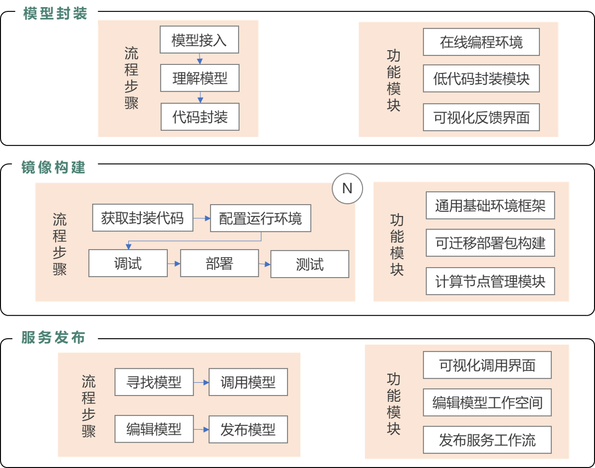

### 服务架构

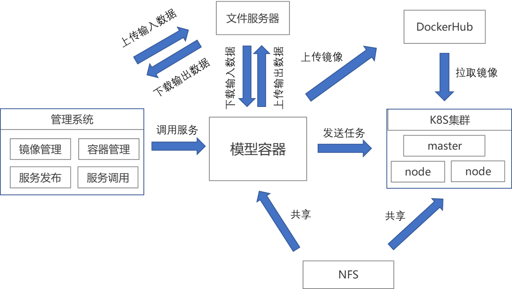

### 使用情景

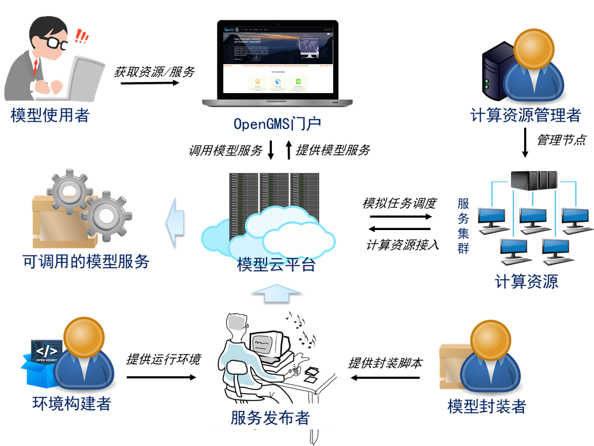

## 演示截图

**登录注册**

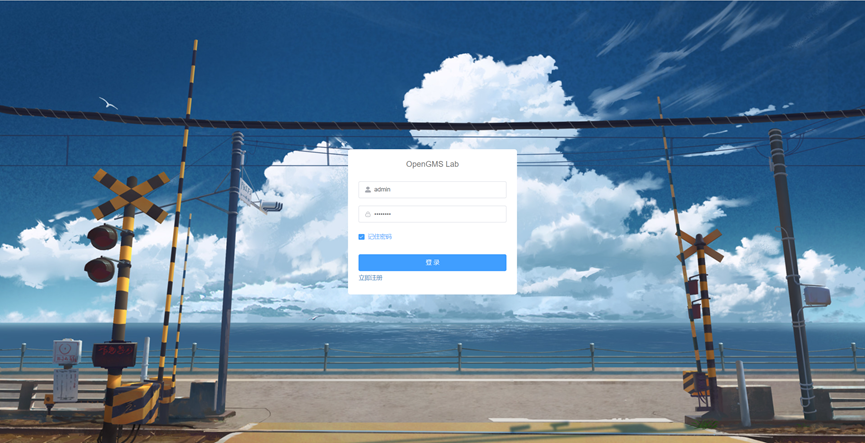

**镜像管理**

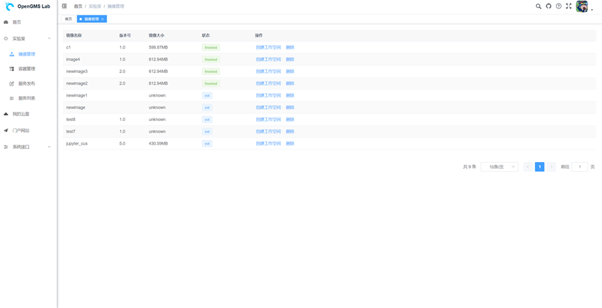

**容器管理**

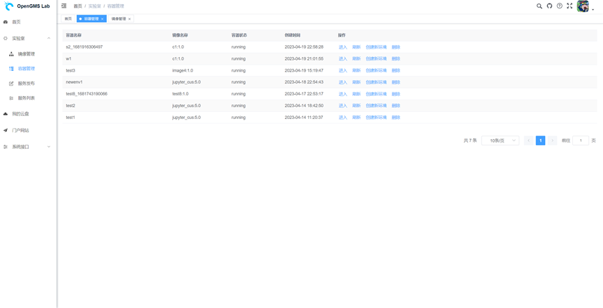

**服务发布**

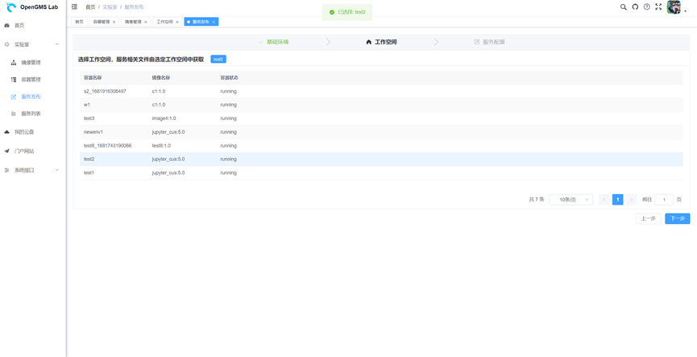

**服务列表**

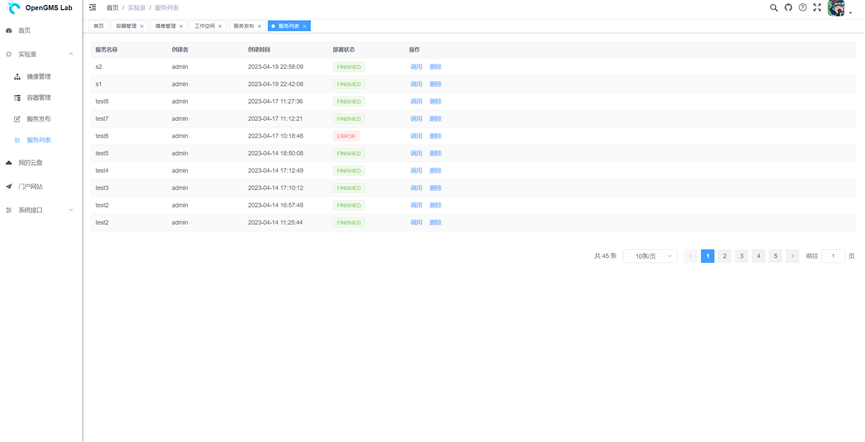

**服务调用**

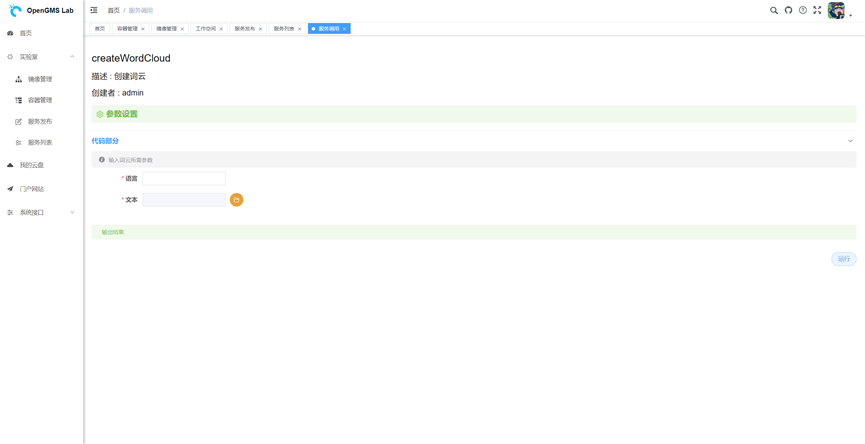

**文件系统**

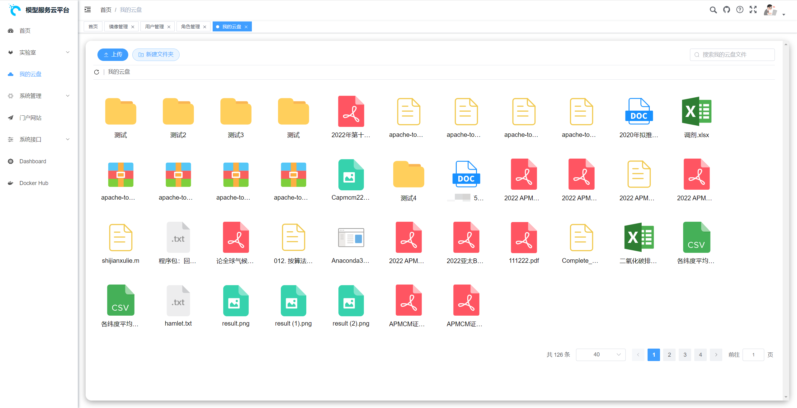

**用户角色管理**

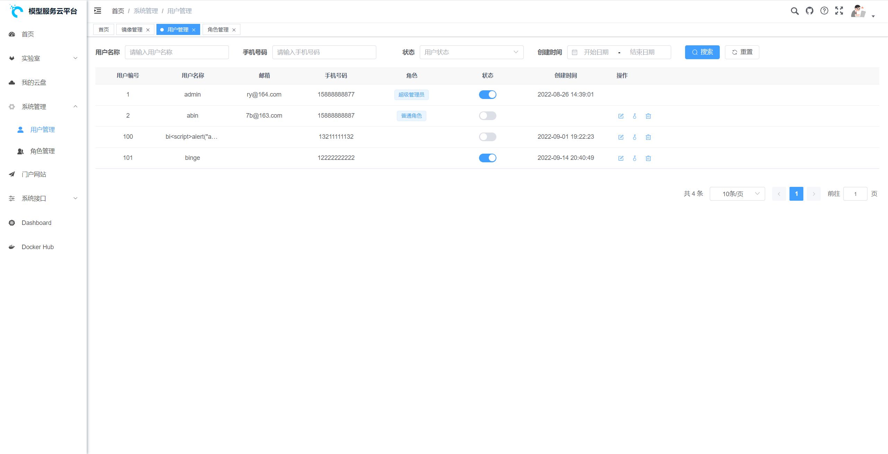