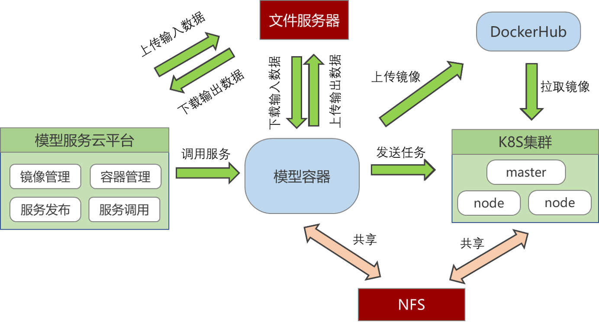

# OpenGMS-Lab

## 项目介绍

提供一个容器镜像构建，模型代码封装、模型服务发布的一站式云平台，实现模型服务的快速部署以及计算资源的合理利用

- 基于微服务架构，将项目分为系统平台、文件系统、模型容器三个模块，实现了平台的模块化设计和解耦，使各个模块可以独立开发、部署和扩展。
- 构建了一套以Docker镜像为运行环境的模型服务发布工作流程，实现了模型服务的快速迁移和发布，大大简化了模型服务的部署和管理
- 基于Netty框架，建立了可靠的网络通信机制，实现了模型容器与模型封装代码之间高效的数据传输和实时通信
- 基于Kubernetes，搭建了一个可扩展的计算集群，实现了计算模型服务的分布式调用，提高了服务的稳定性和计算资源的利用率

## 系统功能

1.登录注册模块：基于Spring Security实现了用户的登录注册功能

2.镜像管理模块：提供一系列镜像管理的功能，这些功能包括但不限于：创建、删除等

3.容器管理模块：提供了一系列操作容器的功能，能够方便地对容器进行操作和管理

4.服务发布模块：主要分为三个步骤：基础环境选择 → 工作空间选择 → 服务配置设置

5.服务列表模块：对发布的服务进行管理，提供一系列的管理操作，包括调用、删除等操作

6.服务调用模块：对发布成功的模型服务进行调用，提供相应计算服务

7.云盘模块：提供了一系列与文件相关的功能。可以进行文件的上传、下载、管理等操作

8.角色管理模块：基于Spring Security实现了用户的身份认证和授权管理

## 系统模块

```
cloud-lab
|
├──lab-admin --系统平台
|
├──lab-drive --文件系统
|
├──lab-container --模型容器
|
├──lab-common --通用工具包

```

## 功能模块


## 关键技术

在我们现在的研究中，我们写好了模型的封装代码以及描述文档之后，把部署包部署到模型容器上，模型容器会解析我们写的这个描述文档，生成模型服务的调用界面，调用这个模型服务时，模型容器与封装代码之间通过socket进行数据传输。我们可以看到其封装代码是运行在我们的计算机上的，模型运行所需要的环境也是直接安装在计算机上。


那么，当我们在这个计算机上部署越来越多模型服务的时候，每个模型之间的运行环境其实都不是一样的，那么这样就容易出现兼容性问题。

所以我们基于容器化的这种机制，将模型服务**从基于操作系统的运行方式改为基于容器的运行方式**，且我们将模型的运行脚本与容器解耦开，容器只提供一个运行环境，充当之前的操作系统，而我们的运行脚本还是放在宿主机的。这样设计如果当我们一些不同服务需要相同环境时可以做到容器镜像的复用。


## 应用模式

基于前面的设计，当我们发布模型服务的时候其实可以分为这几种角色。

主要涉及的角色包括环境构建者、模型封装者、服务发布者、计算资源管理者。

首先，因为计算环境和模型的封装代码已经解耦开来了，因此之后封装人员就可以只专注于封装，而其所需要的运行环境可由环境构建者提供，当一个服务的环境和封装脚本都准备完毕之后，服务的发布者就可以很方便的将模型发布成服务，部署在这个云平台上。

模型如何调度，这就是计算资源管理者需要做的工作。

那么当一个服务可用时，云平台可将该服务公开出去，接入到资源门户由模型使用者来使用。


## 服务架构




## 后续研究

**开放式网络环境下模型服务如何<font color='red'>快速迁移部署</font>**

前面的研究我们是假设一个我们是整个计算集群的管理者，但是在我们设想的这种开放式的网络环境下，所有人都可以贡献自己的计算资源，K8S在这种情况下就不太适用，无法灵活根据计算资源提供者所授予的权限进行操作，因此后续研究第一个研究点就是在开放式的网络环境下如何将模型从计算节点A迁移到计算节点B。

**实现思路：**

- 计算节点A推送模型部署包与环境镜像
- 计算节点B拉取模型部署包与环境镜像
- 更新Manager与计算节点的模型服务信息


**计算节点的<font color='red'>负载不均衡</font>问题如何解决**

在服务运行过程中，计算资源的实际使用需求是动态变化的， 随着时间的推移，这些动态变化会带来节点负载不均衡问题。高负载节点会影响服务的质量(QoS)，从而导致服务的不稳定。负载的不均衡对于整个计算池来说，也会导致资源碎片化，浪费更多的资源， 加重计算资源的运营成本。所以第二个研究内容就是针对计算节点的负载不均衡的问题实现基于计算节点负载的情况动态选择出合适的迁移目标。

**实现思路：**

- 调度算法的选择（多目标选择等）
- 节点的负载检测
- 基于调度算法选择出调度的目标节点


## 演示截图

**登录注册**


**镜像管理**


**容器管理**


**工作空间**


**服务发布**


**服务列表**


**服务调用**


**文件系统**


**用户角色管理**

